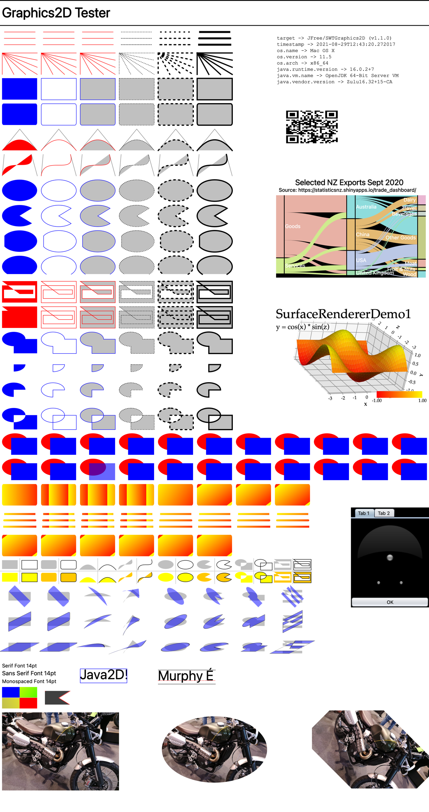

SWTGraphics2D
=============

Version 1.1.1 - not yet released.

(C)opyright 2006-2021, by David Gilbert and Contributors.  All rights reserved.

Overview
--------
**SWTGraphics2D** is an implementation of Java2D's `Graphics2D` API that targets an Eclipse Standard Widget Toolkit (SWT) graphics context, allowing the use of Java2D code in SWT applications.  

Background
----------
The code was originally developed as part of the [JFreeChart](http://github.com/jfree/jfreechart) project .  It is now a standalone project.

Include
-------
**SWTGraphics2D** is published to the Central Repository.  You can include it in your projects with the following dependency:

    <dependency>
      <groupId>org.jfree</groupId>
      <artifactId>swtgraphics2d</artifactId>
      <version>1.1.0</version>
    </dependency>

Testing
-------
**SWTGraphics2D** is being tested using [Graphics2D Tester](https://github.com/jfree/graphics2d-tester) and produces the output shown below (using the snapshot version of `SWTGraphics2D`)

Due to limitations of the SWT Graphics API, there are several Java2D features that cannot be supported:

- the Porter-Duff compositing rules in `AlphaComposite`
- multi-linear and radial gradient paints.

License
-------
**SWTGraphics2D** is free software under the terms of the GNU Lesser General Public License (LGPL) version 2.1 or later.  

    Please note that SWTGraphics2D is distributed WITHOUT ANY WARRANTY; without even
    the implied warranty of MERCHANTABILITY or FITNESS FOR A PARTICULAR PURPOSE.  
    Please refer to the license for details.

Additionally, the code is dual-licensed under the Eclipse Public License 2.0 (with the agreement of the main contributors: David Gilbert, Henry Proudhon and Cedric Chabanois).  

Change History
--------------

Version 1.1.1 (not-yet-released)
- added the Eclipse Public License 2.0 as an option alongside the existing GNU Lesser General Public License.

Version 1.1.0 (29-Aug-2021)
- fixed interaction between `setPaint()` and `setColor()`
- added support for `GradientPaint` (without cyclic attribute) in `setPaint()`
- cache AWT paint setting to return in `getPaint()`  
- apply winding rule in `fill(Shape)`
- improved correctness and efficiency of transformations
- fixed clipping bugs
- implemented `create()` method
- implemented `getDeviceConfiguration()`
- fixed `setFont()` method for `null` argument
- fixed failing tests for `drawImage()` methods with `null` arguments
- added JUnit 5 tests

Version 1.0 (20 February 2016)
- initial release as a standalone project (previously included with JFreeChart SWT support).